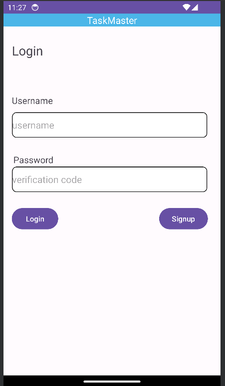

# TaskMaster Android App

TaskMaster is an Android application designed to help you manage your tasks and stay organized. This app allows you to add new tasks, view all tasks, and provides a user-friendly interface for tracking your to-do list.

## Daily Change Log

- **Day 1 (October 16, 2023):**
  - Created the main page with a heading, a "My Tasks" image, and buttons for navigating to the "Add Tasks" and "All Tasks" pages.
  - Implemented the "Add a Task" page, allowing users to input task details (title and body) and display a "submitted!" label when the submit button is clicked.
  - Added the "All Tasks" page, which features a back button and provides the structure for future functionality.

- **Day 2 (October 18, 2023):**
  - Modify the home page to have three hardcoded button tasks.
  - Implemented a "Task Detail" page to display detailed information about a selected task.
  - Developed a "Settings" page for users to enter and save their usernames.
  - Enhanced the home page to display the user's tasks using their username from the "Settings" page.

- **Day 3 (October 23, 2023):**
  - Added the RecyclerView functionality to the homepage.
  - Created a Task class with title, body, and state properties.
  - Populated the RecyclerView with at least three hardcoded Task instances.
  - Enabled tapping on tasks in the RecyclerView to launch the detail page with the correct Task title displayed.

- **Day 4 (October 25, 2023):**
  - Set up Room database for local storage of tasks.
  - Modified the "Add a Task" form to save task data in the local database.
  - Refactored the homepage to display tasks from the local database.
  - Updated the detail page to show task description and status.
  
- **Day 5 (November 6, 2023):**
  - Added Espresso UI testing to enhance the app's quality and reliability.
  
- **Day 6 (November 8, 2023):**
  - Integrated AWS Amplify for cloud data storage to create a scalable backend for the app.
  - Used the Amplify CLI to create a Task resource in DynamoDB that replicates our existing Task schema.
  - Updated all references to the Task data to access data in DynamoDB using AWS Amplify.
  
- **Day 7 (November 13, 2023):**
  - Implemented a second entity for Teams, including a name field and a list of tasks associated with each team.
  - Manually created three teams using mutations to establish initial team data.
  - Modified the "Add Task" form to include a selection mechanism (e.g., Spinner) for assigning tasks to a specific team.
  - Updated the Settings page to allow users to choose their team in addition to their username.
  - Configured the app to display only tasks associated with the selected team on the homepage.
  
- **Day 8 (November 15, 2023):**
  - Added new activity for editing the task information the user has already create it  
  - implements the (Delete and Update) amplify api operations for this goal 
  
- **Day 9 (November 19, 2023):**
  - Integrated AWS Cognito for user authentication.
  - Added user login and sign-up activities allow the user to signup with email and password and logged in to our system 
  - Displayed the logged-in user's username on the home page.
  - Implemented user logout functionality.
  
- **Day 10 (November 26, 2023):**
  - Added the ability for users to optionally attach an image to a task on the "Add a Task" activity.
  - Uploaded attached images to S3 and associated them with the respective tasks.
  - Display images associated with tasks on the Task detail activity.
  
_ **Day 11 (November 27, 2023):**
  - Implemented the ability to share photos from other apps.
  - Added an intent filter to the "Add a Task" activity to handle shared images.
  - Users can now hit the "share" button on an image in another app, choose TaskMaster, and be taken directly to the "Add a Task" activity with the image pre-selected.

- **Day 12 (November 29, 2023):**
  - Implemented automatic location retrieval and inclusion in the saved Task when the user adds a new task.
  - Display the location on the Task Detail activity if it exists.

## Screenshots

## Setup

To get started with the TaskMaster Android app:

1. Create a new directory and repo named "taskmaster."

2. Use Android Studio to set up a new app following the instructions discussed in class.

3. Clone this repository and open the project in Android Studio.

4. Set up AWS Amplify and Cognito:
  - Follow the Amplify documentation to add Cognito for user authentication.
  - Run the app on an Android emulator or a physical device to experience the new login and logout features.

## Features

## AWS Amplify Integration

We have integrated AWS Amplify to add cloud functionality to our TaskMaster app. Here's what we did on Day 6:

### Homepage

- We refactored the homepage's RecyclerView to display all Task entities from DynamoDB. That are related to the user settings assigned team

### Task Detail Page:
- Display task title, description, and status.

### Settings Page:
- Allow users to enter and save their usernames. in addition to the ability for the user to specify the team name that he wants relative tasks to be appeared in the home page 

### Add a Task

- We modified the "Add Task" form to save the data entered as a Task to DynamoDB. When users add a new task, it's now stored in the cloud. alongside the capability for users to assign this task for a specific team

### All Tasks

The "All Tasks" page currently features a back button and will be enhanced to display tasks from the local database, allowing users to view all their tasks at a glance.

### Edit Tasks

- we create new page activity (edit task) for allowing the users to edit their task info

## User Authentication with AWS Cognito

We have integrated AWS Cognito to enhance the security and user authentication of our TaskMaster app. Here's a summary of the new features:

### User Login

- AWS Cognito is now part of our Amplify setup, providing a secure authentication mechanism.
- Users can log in using the pre-built Cognito UI, ensuring a seamless and secure login experience.
- The logged-in user's username is displayed on relevant pages, offering a personalized experience.

### User Logout

- Implemented a user logout functionality, allowing users to securely log out of the application.

### Uploads

- On the "Add a Task" activity, users can now optionally select an image to attach to a task.
- If an image is attached, it will be uploaded to S3 and associated with the task.

### Displaying Files

- On the Task detail activity, if there is an image associated with a particular task, it will be displayed within that activity.

### Adding a Task from Another Application

- Added an intent filter to the "Add a Task" activity, enabling users to share images from other apps.
- Users can hit the "share" button on an image in another app, choose TaskMaster, and be taken directly to the "Add a Task" activity with the image pre-selected.

### Location
- When the user adds a task, their location is automatically retrieved and included as part of the saved Task.
- On the Task Detail activity, the location of a Task is displayed if it exists.

## Espresso Testing
1. **Assert Important UI Elements**:
  - UI elements that are crucial for the app's functionality are verified to be displayed on the page, ensuring a seamless user experience.

2. **Task Detail Display Test**:
  - A test has been added to tap on a task, and the resulting activity is tested to ensure that it displays the name of the selected task correctly.

3. **Username Edit Test**:
  - The user's ability to edit their username has been tested, and it is verified that the updated username is correctly displayed on the homepage.

Start building your TaskMaster app and have fun developing your project!

## Author

Zaid Izziddine
