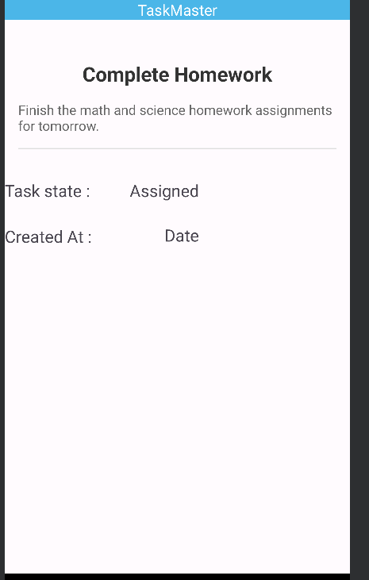

# TaskMaster Android App

TaskMaster is an Android application designed to help you manage your tasks and stay organized. This app allows you to add new tasks, view all tasks, and provides a user-friendly interface for tracking your to-do list.

## Daily Change Log

- **Day 1 (October 16, 2023):**
  - Created the main page with a heading, a "My Tasks" image, and buttons for navigating to the "Add Tasks" and "All Tasks" pages.
  - Implemented the "Add a Task" page, allowing users to input task details (title and body) and display a "submitted!" label when the submit button is clicked.
  - Added the "All Tasks" page, which features a back button and provides the structure for future functionality.

- **Day 2 (October 18, 2023):**
  - Modify the home page to have three hardcoded button tasks.
  - Implemented a "Task Detail" page to display detailed information about a selected task.
  - Developed a "Settings" page for users to enter and save their usernames.
  - Enhanced the home page to display the user's tasks using their username from the "Settings" page.

- **Day 3 (October 23, 2023):**
  - Added the RecyclerView functionality to the homepage.
  - Created a Task class with title, body, and state properties.
  - Populated the RecyclerView with at least three hardcoded Task instances.
  - Enabled tapping on tasks in the RecyclerView to launch the detail page with the correct Task title displayed.

- **Day 4 (October 25, 2023):**
  - Set up Room database for local storage of tasks.
  - Modified the "Add a Task" form to save task data in the local database.
  - Refactored the homepage to display tasks from the local database.
  - Updated the detail page to show task description and status.

## Screenshots

## Setup

To get started with the TaskMaster Android app:

1. Create a new directory and repo named "taskmaster."

2. Use Android Studio to set up a new app following the instructions discussed in class.

3. Clone this repository and open the project in Android Studio.

4. Run the app on an Android emulator or a physical device to see the main page with navigation buttons.

## Features

### Homepage

The main page of the app now includes a dynamic RecyclerView to display the lists of tasks, making it easy for users to view and manage their tasks. This replaces the previous approach of three hardcoded task buttons. Users can tap on a task to navigate to the "Task Detail" page.

### Task Detail Page:
- Display task title, description, and status.

### Settings Page:
- Allow users to enter and save their usernames.

### Add a Task

On the "Add a Task" page, users can input details about a new task, including a title and a body. Clicking the "submit" button saves the task in the local database and displays a "submitted!" label on the page.

### All Tasks

The "All Tasks" page currently features a back button and will be enhanced to display tasks from the local database, allowing users to view all their tasks at a glance.

## Resources

- [Android Buttons Documentation](https://developer.android.com/guide/topics/ui/controls/button)
- [Android UI Events Documentation](https://developer.android.com/guide/topics/ui/ui-events)
- [RecyclerView Documentation](https://developer.android.com/guide/topics/ui/layout/recyclerview)

Start building your TaskMaster app and have fun developing your project!

## Author

Zaid Izziddine
