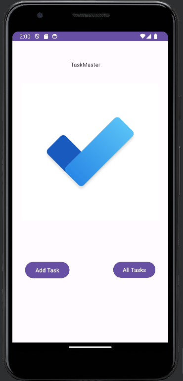

# TaskMaster Android App

TaskMaster is an Android application designed to help you manage your tasks and stay organized. This app allows you to add new tasks, view all tasks, and provides a user-friendly interface for tracking your to-do list.

## Daily Change Log

- **Day 1 (October 16, 2023):** 
   - Created the main page with a heading, a "My Tasks" image, and buttons for navigating to the "Add Tasks" and "All Tasks" pages.
   - Implemented the "Add a Task" page, allowing users to input task details (title and body) and display a "submitted!" label when the submit button is clicked.
   - Added the "All Tasks" page, which features a back button and provides the structure for future functionality.

## Screenshots

## Setup

To get started with the TaskMaster Android app:

1. Create a new directory and repo named "taskmaster."

2. Use Android Studio to set up a new app following the instructions discussed in class.

3. Clone this repository and open the project in Android Studio.

4. Run the app on an Android emulator or a physical device to see the main page with navigation buttons.

## Features

### Homepage

The main page of the app includes:
- A heading at the top of the page.
- An image to mock the "My Tasks" view.
- Buttons at the bottom of the page for navigating to the "Add Tasks" and "All Tasks" pages.

### Add a Task

On the "Add a Task" page, users can:
- Type in details about a new task, including a title and a body.
- Click the "submit" button to display a "submitted!" label on the page.

### All Tasks

The "All Tasks" page features:
- An image with a back button.
- Currently, it has no additional functionality.

## Resources

For Android development and user interface (UI) design, you can refer to the following resources:

- [Android Buttons Documentation](https://developer.android.com/guide/topics/ui/controls/button)
- [Android UI Events Documentation](https://developer.android.com/guide/topics/ui/ui-events)

Start building your TaskMaster app and have fun developing your project!

## Author

Zaid Izziddine

